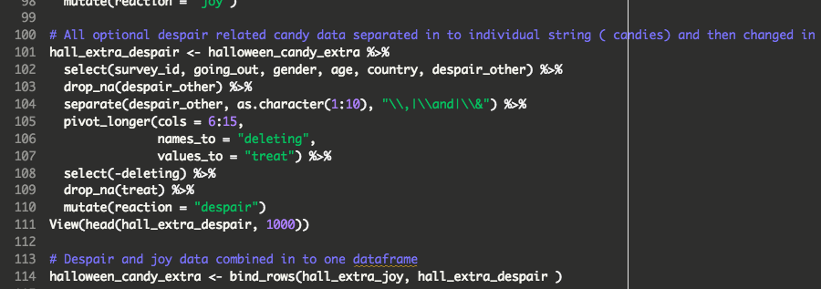
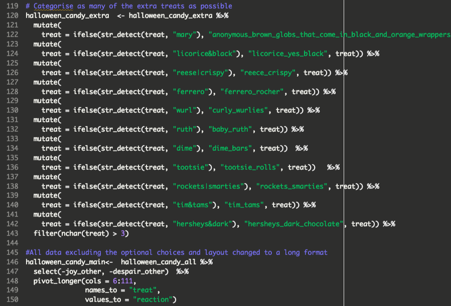
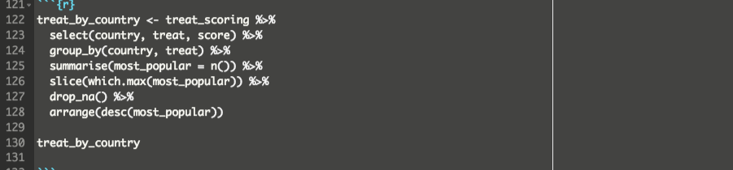

# Data Wrangling Project

#### A Dirty Data Project

Tasked with extracting meaningful insights from 3 untidy raw datasets.  I cleaned and reorganised
with dplyr, janitor, and stringr packages and utilised pivoting, joining, ifelse and column separation
functions, whereby analysis was carried out and the brief’s questions answered..  Highlight: I was
the only student in the cohort to extract data from a column containing the submitter’s optional 
text input and integrate into the data returned for analysis.

###### Personal code example 1
The use of dplyr and bind_rows()

###### Personal code example 2
ifelse() and pivoting highlights

###### Personal code example 3 

